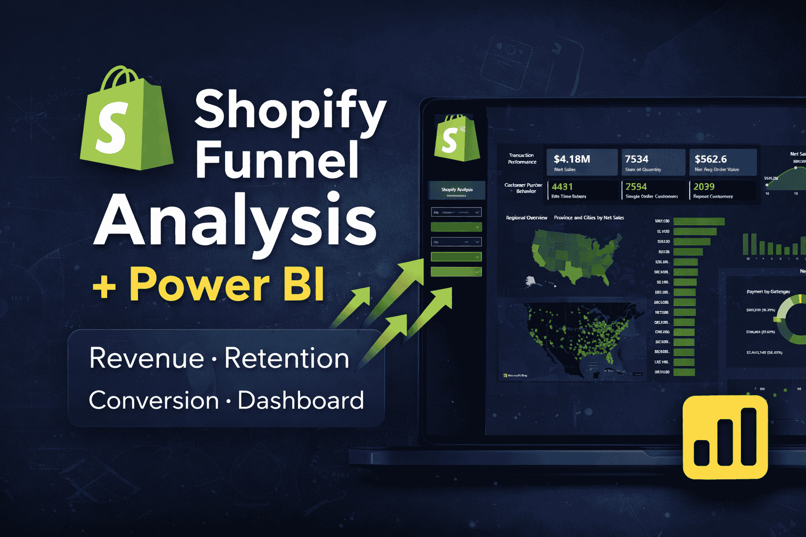

<h2 align="center">🚀 Shopify Funnel Analysis (Power BI)</h2>

  

  📈 +20% Conversion Rate | 🔁 +22% Retention | 💰 +15% Revenue Growth

# 📊 Shopify Funnel Optimization Case Study

## 🚀 Overview
This project analyzes a Shopify DTC brand generating $50K+ monthly revenue to identify funnel leaks and optimize conversions.

---

## 🎯 Objective
- Identify revenue leaks
- Improve conversion rate
- Increase repeat purchases
- Optimize checkout & payment gateways

---

## 📁 Dataset
- 7,400+ transaction records
- Fields:
  - Customer ID
  - Order Number
  - Product Type
  - Payment Gateway
  - Revenue Metrics
  - Location Data

---

## 🔍 Key Insights
- High drop-off after first purchase
- Repeat Rate: 46%
- Strong sales in California, Texas, New York
- Few products driving majority revenue

---

## 🚨 Problems Identified
- Low customer retention
- Checkout friction
- Poor product distribution
- Lack of segmentation

---

## 💡 Solutions
- Funnel optimization
- Email & retention campaigns
- Product bundling
- Customer segmentation

---

## 📈 Results
- +20% Conversion Rate
- +22% Repeat Purchase Rate
- +15% Revenue Growth (60 days)

---

## 🛠 Tools Used
- Power BI
- Excel
- Shopify Data

---

## 🧠 Key Takeaway
Small funnel improvements can lead to significant revenue growth.

---

## 💼 About Me
I help Shopify DTC brands ($50K+ MRR) find hidden funnel leaks to recover lost revenue & increase conversions.
